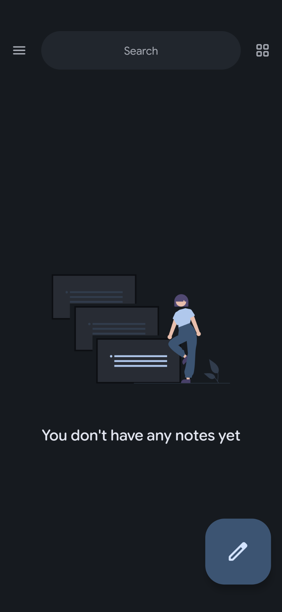
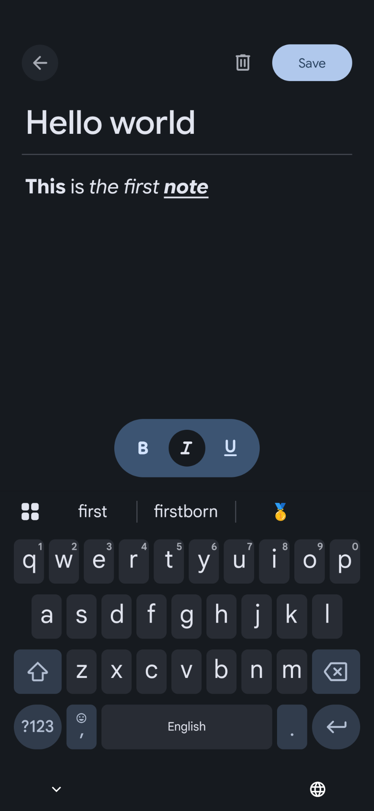
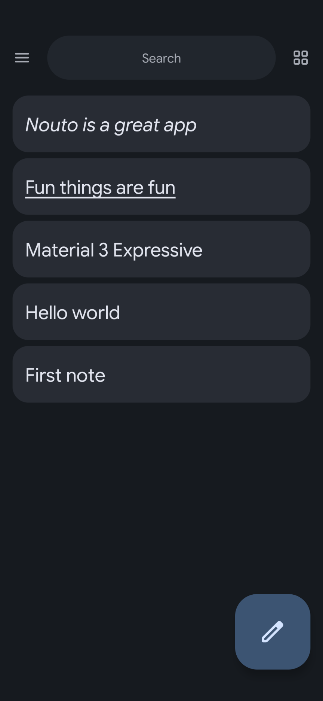
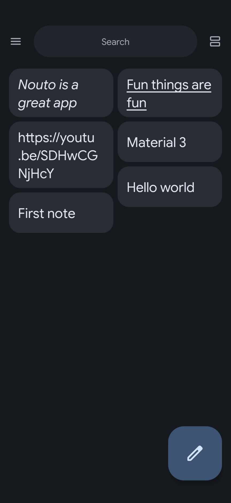
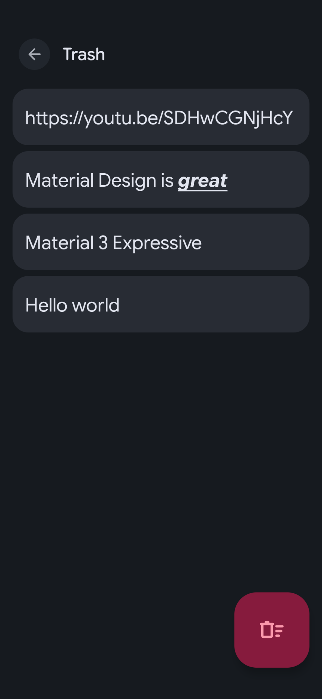
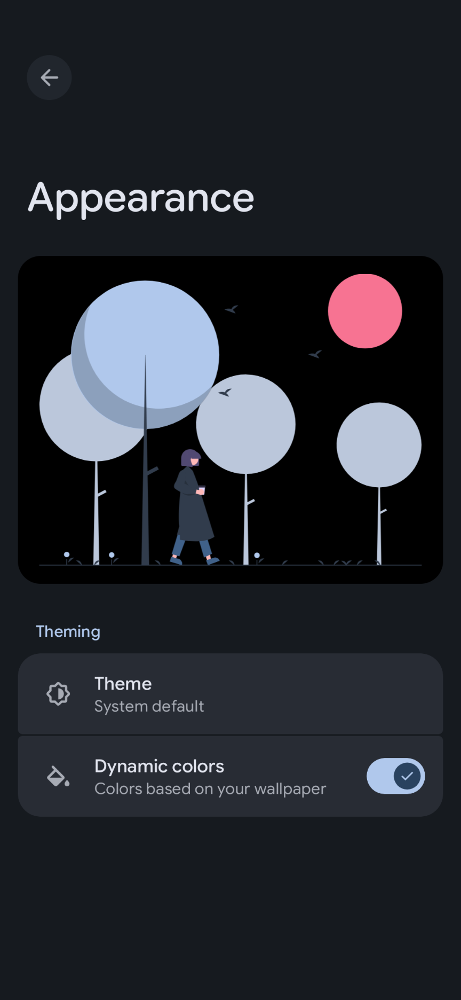

# Nouto

[](https://github.com/HotarunIchijou/Nouto/releases/latest)
[](https://github.com/HotarunIchijou/Nouto/actions)
[](/LICENSE)


Nouto is a simple and elegant notes app built in Kotlin with Material 3 Expressive Design. It focuses heavily on user experience — fluid transitions, intuitive gestures, and a clean interface that stays out of your way.

## ✨ Key features
* **Material 3 Expressive design:** Sleek and modern UI with dynamic color support and smooth transitions
* **Swipe to delete with undo:** Delete notes with a swipe and restore them instantly via Snackbar
* **Trash:** Recover accidentally deleted notes before they're permanently removed
* **Predictive back gestures:** Full support for Android 14+ predictive back navigation
* **Dynamic color:** Picks up your wallpaper's color scheme on Android 12+ via Material You
* **Offline-first:** Everything is stored locally — no account required, no network calls

## ⬇️ Downloads
[](https://apt.izzysoft.de/fdroid/index/apk/org.kaorun.nouto)
[](https://github.com/HotarunIchijou/Nouto/releases/latest)

## 🎨 Screenshots
|  |  |  |
|--------------------------------------------------------------------------------|--------------------------------------------------------------------------------|--------------------------------------------------------------------------------|
|  |  |  |

## 🧰 Build instructions
1. Clone this repository:
```
git clone https://github.com/kaorun/nouto.git
```
2. Open the project in Android Studio
3. Sync Gradle files and resolve dependencies
4. Run the project on an emulator or a physical device

## 🛠️ Tech Stack
* **Programming language:** Kotlin
* **Design framework:** Material 3 Expressive
* **Architecture:** MVVM + LiveData
* **Navigation:** Navigation Component + Safe Args
* **Database:** Room (SQLite)

## 📧 Contact
Feel free to reach out with questions or suggestions:
* Email: hotarunichijou@ik.me
* Telegram: [@KaorunIchijou](https://t.me/KaorunIchijou)

## 🙌 Special thanks to:  
[1gravity](https://github.com/1gravity) for creating native [rich text library](https://github.com/1gravity/Android-RTEditor)
